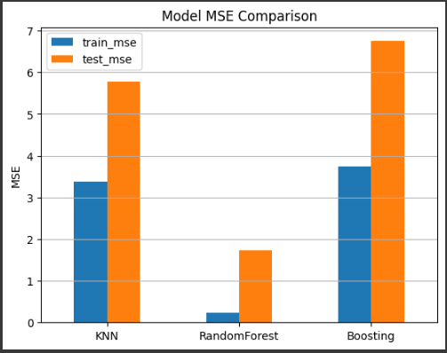

# Laporan Proyek Machine Learning - **Prediksi Anemia**

## **Project Overview**
Proyek ini bertujuan untuk membangun model machine learning yang dapat memprediksi performa murid berdasarkan dataset yang mencakup fitur seperti jam belajar, jam tidur, skor sosial ekonomi, kehadiran (%), dan nilai akhir (grades). Dengan pendekatan ini, diharapkan dapat memberikan wawasan yang berguna untuk mendukung pengambilan keputusan dalam meningkatkan kualitas pendidikan.

Pentingnya proyek ini terletak pada potensinya untuk membantu pendidik dan institusi memahami faktor-faktor yang berpengaruh terhadap performa murid. Menurut jurnal dari (Ibrahim et al., 2024), menunjukkan bahwa faktor
akademis dan non-akademis, seperti skor sebelumnya, jam belajar, serta motivasi, memiliki pengaruh signifikan terhadap hasil belajar. Dengan memanfaatkan pendekatan berbasis data ini, model yang dibangun diharapkan dapat menjadi alat pendukung untuk mengidentifikasi murid yang berisiko rendah sehingga memungkinkan intervensi dini.

**Referensi**: [Link Referensi](https://www.researchgate.net/profile/Ibrahim-Haruna-Ibrahim/publication/384625747_Predictive_Model_for_Identification_and_Analysis_of_Factors_Impacting_Students_Academic_Performance_Using_Machine_Learning_Algorithms/links/66ffb179906bca2ac3e001b8/Predictive-Model-for-Identification-and-Analysis-of-Factors-Impacting-Students-Academic-Performance-Using-Machine-Learning-Algorithms.pdf)  

---

## **Business Understanding**

### **Problem Statements**
1. Bagaimana cara membuat model machine learning untuk memprediksi nilai akhir murid dengan akurasi yang baik?
2. Model mana yang paling sesuai untuk memprediksi performa murid berdasarkan evaluasi?
3. Bagaimana fitur seperti jam belajar, jam tidur, dan kehadiran memengaruhi performa murid?

### **Goals**
1. Mengembangkan model regresi untuk memprediksi nilai akhir murid berdasarkan fitur yang tersedia.
2. Mengevaluasi performa beberapa algoritma machine learning seperti K-Nearest Neighbors, Random Forest, dan AdaBoost.
3. Memberikan wawasan dari analisis data untuk mendukung pemahaman lebih baik mengenai faktor yang memengaruhi nilai murid.

### **Solution Approach**
- **Solution 1**: K-Nearest Neighbors (KNN): Model regresi berbasis jarak untuk memprediksi nilai.  
- **Solution 2**: Random Forest: Model ensemble berbasis decision tree untuk meningkatkan akurasi dan mengurangi overfitting.
- **Solution 3**:  AdaBoost: Algoritma boosting untuk meningkatkan performa model. 

---

## **Data Understanding**

### **Dataset**
Dataset digunakan Kaglle yang berisi 1388 sampel data. Setiap baris data mencakup informasi seperti:  
- `Study Hours`: Rata-rata jam belajar per hari.  
- `Sleep Hours`: Rata-rata jam tidur per hari.  
- `Socioeconomic Score`: Skor sosial ekonomi murid.  
- `Attendance (%)`: Persentase kehadiran.  
- `Grades`: Nilai akhir murid (Target Prediksi).  

**Link dataset**: [Download Dataset](https://www.kaggle.com/datasets/stealthtechnologies/predict-student-performance-dataset/data)

### **Visualisasi dan Insight**
- Analisis distribusi fitur `Study Hours`, `Sleep Hours`, dan `Attendance (%)` menunjukkan bahwa sebagian besar murid memiliki rata-rata jam belajar di bawah 5 jam per hari dan tingkat kehadiran di bawah 75%.
- Heatmap korelasi menunjukkan hubungan positif antara `Study Hours` dan nilai akhir `(Grades)`, sementara `Sleep Hours` dan `Study Hours` memiliki hubungan yang lebih lemah.  

---

## **Data Preparation**
1. **Pembersihan Data**: Menghapus nilai yang hilang atau tidak valid dari dataset. 
2. **Scaling**: Menggunakan `StandardScaler` untuk menormalkan fitur numerik.  
3. **Splitting**: Membagi dataset menjadi data training (80%) dan testing (20%) menggunakan `train_test_split`.  

---

## **Modeling**
Tiga algoritma digunakan dalam proyek ini:  
1. **K-Nearest Neighbor (KNN)**:  
   Model KNN dengan parameter default (`n_neighbors=5`) diterapkan pada data yang telah diproses.  

2. **Random Forest**:  
   Random Forest diterapkan dengan 100 pohon keputusan untuk meningkatkan stabilitas dan akurasi.  

3. **AdaBoost**:  
   Algoritma boosting ini menggunakan 50 estimator untuk memperbaiki kesalahan prediksi.  

---

## **Evaluation**
Metrik evaluasi yang digunakan untuk menilai performa model:  
- **Mean Squared Error (MSE)**: Rata-rata kesalahan kuadrat dari prediksi.
  
### **Hasil Evaluasi**
| Model              | Train_mse | Test_mse  | 
|--------------------|-----------|-----------|
| K-Nearest Neighbor | 3.381574  | 5.782815  |
| Random Forest      | 0.232899  | 1.723313  |  
| AdaBoost           | 3.736187  | 6.746766  |

**Model terbaik**: Random Forest dengan Train_mse hanya **0.232899** dan Test_mse hanya **1.723313**.  

### **Visualisasi Model MSE Comparison**

---

## **Kesimpulan**
1. Model Random Forest menunjukkan performa terbaik dalam memprediksi nilai akhir murid dengan Train_mse hanya 0.232899.
2. Faktor seperti `Study Hours`, `Socioeconomic Score`, dan `Attendance (%)` memiliki korelasi signifikan terhadap nilai akhir.
3. Model ini dapat digunakan sebagai alat bantu untuk mendukung pengambilan keputusan dalam dunia pendidikan.

--- 
